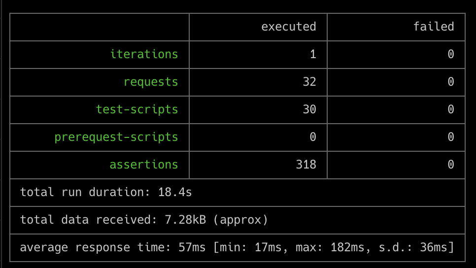

# 


> ### [RealWorld](https://github.com/gothinkster/realworld) practice with Golang/Gin refactored with clean architecture and microservices practice (e.g. caching, distributed lock, monitoring and containerize ...)


This codebase was cloned from [golang-gin-realworld-example-app](https://github.com/gothinkster/golang-gin-realworld-example-app) and refactored with clean architecture + docker and adding modern practices

#### Full list what has been used:
* [Gin](https://github.com/gin-gonic/gin) - Web framework
* [PostgresSQL](https://www.postgresql.org/) - Relational Database
* [Gorm](https://github.com/go-gorm/gorm) - Object-Relational-Mapping library for Golang
* [pgx](https://github.com/jackc/pgx) - ORM library for Golang
* [go-redis](https://github.com/go-redis/redis) - Type-safe Redis client for Golang
* [redislock](https://github.com/bsm/redislock) - Distributed lock client with redis for Golang
* [zap](https://github.com/uber-go/zap) - Logger
* [validator](https://github.com/go-playground/validator) - Go Struct and Field validation
* [jwt-go](https://github.com/dgrijalva/jwt-go) - JSON Web Tokens (JWT)
* [uuid](https://github.com/google/uuid) - UUID
* [CompileDaemon](https://github.com/githubnemo/CompileDaemon) - Compile daemon for Golang
* [Docker](https://www.docker.com/) - Docker
* [Jaeger](https://www.jaegertracing.io/docs/1.21/opentelemetry/) - A distributed tracing system released as open source by Uber Technologies 
* [Prometheus](https://prometheus.io/docs/introduction/overview/) - open-source systems monitoring and alerting toolkit originally built at [SoundCloud](https://soundcloud.com/)

# Directory structure

```text
.
├── cmd
│   └── api                
│       └── main.go     // server entry point
├── internal
│   └── [modules]                
│       └── delivery
│           └── http
│               └── handlers.go            // implementation of module http handlers
│               └── routes.go              // implementation of module routes binding
│               └── serializers.go         // implementation of data model to http response serializations
│               └── validator.go           // implementation of http response validations
│       └── repository
│           └── [db_type]_repository.go    // implementation of persistance layer  
│       └── usecase
│           └── [module]_usecase.go        // implementation of businese logic 
│       └── delivery.go                    // interface of module handler and router binding
│       └── [db_type]_repository.go        // interface of module persistance layer
│       └── usecase.go                     // interface of module business logic 
│   └── middleware                
│       └── [middlewares].go               // server middlewares
│       └── middlewares.go                 // entry and constructor of middleware manager
│   └── models                
│       └── [modules].go                   // domains and data modeling methods
│   └── server                
│       └── handler.go                     // module instances creation and base point of route bindings
│       └── server.go                      // constructor of server and commands
├── pkg
│   └── db               
│       └── [db_type]                      // implementation and abstractions of data access layer
│           └── xxx.go
│   └── httpErrors                         // http error interface and utilities 
│       └── xxx.go     
│   └── locker                
│       └── xxx.go                         // distributed lock abstraction and instance
│   └── metric                
│       └── xxx.go                         // telemetrics connection and instance
│   └── utils                
│       └── xxx.go                         // packages of application utilities 
├── ...
...
```

# Getting started

## Install Golang

Make sure you have Go 1.18 or higher installed.

https://golang.org/doc/install

## Environment Config

Set-up the standard Go environment variables according to latest guidance (see https://golang.org/doc/install#install).


## Install Dependencies

From the project root, run:

```cmd
go build ./...
go test ./...
go mod tidy
```
<!-- 
## Testing
From the project root, run:
```
go test ./...
```
or
```
go test ./... -cover
```
or
```
go test -v ./... -cover
```
depending on whether you want to see test coverage and how verbose the output you want. -->

## Run local development server

```cmd
docker-compose up -d
go run cmd/api/main.go
```

## End-to-End

[RealWorld](https://github.com/gothinkster/realworld) provides end-to-end testing from a [postman specification](https://github.com/gothinkster/realworld/tree/master/api) to verify application behavior



## Todo

* Configuration
* SSL
* CSRF
* Makefile
* Unit test

### Jaeger UI

http://localhost:16686

### Prometheus UI

http://localhost:9090

### Grafana UI

http://localhost:3000